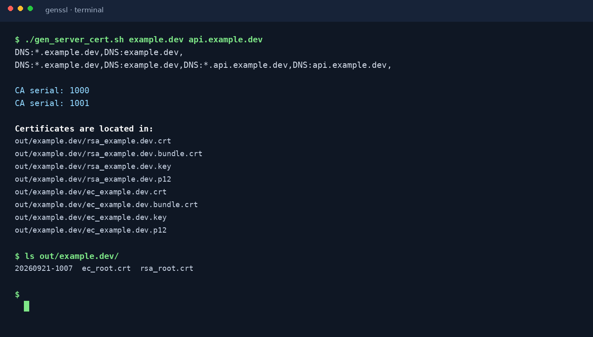

# 自签泛域名证书
此工具用于颁发泛域名证书，方便开发环境调试。

请勿用于生产环境，生产环境还是购买正式的证书。  
或者到 [Let's Encrypt](https://letsencrypt.org/) 可以申请到免费证书  
（支持多域名和泛域名）。

## 优点
1. 你可以创建任意网站证书，只需导入一次根证书，无需多次导入；
1. 减少重复又无谓的组织信息输入，创建证书时只需要输入域名；
1. 泛域名证书可以减少 `nginx` 配置，例如你要模拟 CDN：  
假设你的项目网站是 `example.dev`，CDN 网站设置为 `cdn.example.dev`，  
你只需在 `nginx` 里面配置一个网站，`server_name` 同时填写  `example.dev`  
和 `cdn.example.dev`，它们可以使用同一个 `*.example.dev` 的证书。
1. 现在你只需要一个证书，就可以搞定所有项目网站！

使用 `SAN` 来支持多域名和泛域名：
```ini
subjectAltName=DNS:*.one.dev,DNS:one.dev,DNS:*.two.dev,DNS:two.dev,DNS:*.three.dev,DNS:three.dev
```

## 系统要求
1. Linux，openssl
1. 事先用 `hosts` 或者 `dnsmasq` 解析你本地开发的域名，  
例如把 `example.dev` 指向 `127.0.0.1`

## 使用
```bash
./gen_server_cert.sh <domain> [<domain2>] [<domain3>] [<domain4>] ...
```
把 `<domain>` 替换成你的域名，例如 `example.dev`

运行的输出像这样：



如果有多个项目网站，可以把所有网站都加上去，用空格隔开。

生成的证书位于：
```text
out/<domain>/rsa_<domain>.crt
out/<domain>/rsa_<domain>.bundle.crt
```

证书有效期是 2 年，你可以修改 `ca.cnf` 来修改这个年限。

根证书位于：  
`out/rsa_root.crt` 和 `out/ec_root.crt`  
成功之后，把根证书导入到操作系统里面，信任这个证书。

根证书的有效期是 20 年，你可以修改 `gen_root_cert.sh` 来修改这个年限。

证书私钥位于：  
`out/<domain>/rsa_<domain>.key` 或 `out/<domain>/ec_<domain>.key`

其中 `<domain>.bundle.crt` 是已经拼接好 CA 的证书，可以添加到 `nginx` 配置里面。  
然后你就可以愉快地用 `https` 来访问你本地的开发网站了。

## 清空
你可以运行 `flush.sh` 来清空所有历史，包括根证书和网站证书。

## 在线管理 API

项目现在提供单机在线管理界面的静态页面（`web/index.html`）和 REST API 文档（[docs/API.md](docs/API.md)）。启动 API 服务后，在浏览器打开服务根路径即可完成：

* 查看根 CA 和已签发证书；
* 在线生成客户端或服务器证书（包括 SAN、有效期和 RSA、EC 或两者的密钥类型）；
* 下载证书 ZIP 包或登记应用/容器归属。

典型接口如下：

```text
GET  /api/health
GET  /api/ca                 # 也兼容 /api/roots
POST /api/ca/initialize
GET  /api/certificates
POST /api/certificates       # {type,name,sans,days,key_type}
GET  /api/certificates/{id}/download
GET  /api/registrations
POST /api/registrations
```

构建后的页面只依赖浏览器原生 JavaScript；在线服务面向单机/内网集中管控，暂不包含认证、吊销和二级代理商功能。

### 使用 Bun 构建界面

仓库附带 `package.json`，可以用 [Bun](https://bun.sh/) 将 `frontend/main.ts` 和样式打包到 `web/app.js`、`web/styles.css`，然后由同一个 Python 服务提供页面和 API：

```bash
bun install                 # 安装 Bun 开发依赖（包括 E2E 浏览器客户端）
bun run build               # 生成 web/app.js 和 web/styles.css
ROOTPASS='change-me' bun run start
```

只调试前端时可运行 `bun run dev` 监听源码变化；需要同时管理前后端时使用下一节的 `bun run dev:start`。服务端默认按 `web/dist`、`dist`、`web` 的顺序查找静态页面；也可以通过 `--web-dir` 或 `CERT_WEB_DIR` 指定 Bun 的构建目录。静态资源支持 MIME 类型、浏览器 `HEAD` 探测和前端路由回退到 `index.html`。

### 单机开发版进程控制

开发版提供统一的前后端进程控制器。它会把 PID 和日志保存在被忽略的 `.dev/` 目录，不会通过模糊匹配杀掉其他进程：

```bash
bun run dev:start      # 构建前端并启动 Bun watcher + Python API
bun run dev:status     # 查看前后端 PID 和状态
bun run dev:reload     # 重建前端并仅重启后端，保留前端 watcher
bun run dev:restart    # 停止并重新启动前后端
bun run dev:stop       # 停止前后端
bun run dev:logs       # 追踪两个进程的日志
```

也可以使用等价的 Make 命令：`make dev-start`、`make dev-status`、`make dev-reload`、`make dev-restart`、`make dev-stop`、`make dev-logs`；并提供更短的 `make start`、`make status`、`make reload`、`make restart`、`make stop`、`make logs` 别名（`make dev` 等同于 `make dev-start`）。通过 `ROOTPASS`、`DEV_HOST`、`DEV_PORT` 可以设置根 CA 密码、监听地址和端口；例如 `ROOTPASS='change-me' DEV_PORT=18080 make dev-start`。

启动服务（根 CA 密码通过环境变量提供；若未执行构建，请先运行 `bun run build`）：

```bash
ROOTPASS='change-me' python3 server.py --host 0.0.0.0 --port 8080
```

首次运行后打开 <http://127.0.0.1:8080/>，点击“初始化根 CA”，或直接调用 `POST /api/ca/initialize`。服务会在 `out/` 下保存根证书、签发文件和 SQLite 登记库；`flush.sh` 可在停止服务后清空这些本地状态。

### Docker Compose 生产部署

仓库提供多阶段 `Dockerfile` 和 `docker-compose.yml`。Bun 只用于构建前端，运行容器只包含 Python、OpenSSL 和生成后的静态资源。证书、CA 密钥、OpenSSL 状态文件和 SQLite 数据库保存在名为 `corntech-certificate-data` 的 Docker volume 中。

```bash
cp .env.example .env
# 编辑 .env，设置强随机 ROOTPASS、WEB_USERNAME 和 WEB_PASSWORD
docker compose up --build -d
docker compose ps
```

访问 <http://127.0.0.1:8080/> 时使用 `WEB_USERNAME` / `WEB_PASSWORD` 登录；网站入口、静态资源、API 和证书下载都会要求 Basic Auth。只有 `/api/health` 保持公开，供 Docker 健康检查使用。服务正常后在界面中初始化根 CA。修改 `.env` 中的 `CERT_PORT` 可以更换宿主机端口。备份生产数据时停止服务并备份该 volume；不要删除它，否则会丢失根 CA 私钥和已签发证书。

### Bun E2E 测试

E2E 测试使用 Bun 的测试运行器、Playwright 浏览器客户端和临时的隔离 CA/API 实例，不会修改项目的 `out/` 数据。首次运行需要用 Bun 下载 Chromium：

```bash
bun install
bun run e2e:install
bun run e2e
```

`bun test` 也会发现 `e2e/*.e2e.test.ts`；修改界面后可用 `bun run check` 只执行构建检查。测试覆盖 CA 初始化、应用登记、客户端/服务器证书签发、SAN 搜索、类型过滤、详情与 ZIP 下载、抽屉交互、API 故障提示和移动端布局。

## 配置
你可以修改 `ca.cnf` 来修改你的证书年限。
```ini
default_days    = 730
```

可以修改 `gen_root_cert.sh` 来自定义你的根证书名称和组织。

也可以修改 `gen_server_cert.sh` 或 `gen_client_cert.sh` 来自定义证书组织。

## 参考 / 致谢
[Vault and self signed SSL certificates](http://dunne.io/vault-and-self-signed-ssl-certificates)

[利用OpenSSL创建自签名的SSL证书备忘](http://wangye.org/blog/archives/732/)

[Provide subjectAltName to openssl directly on command line](http://security.stackexchange.com/questions/74345/provide-subjectaltname-to-openssl-directly-on-command-line)

## 关于 Let's Encrypt 客户端
官方客户端 `certbot` [太复杂了](https://github.com/Neilpang/acme.sh/issues/386)，推荐使用 [acme.sh](https://github.com/Neilpang/acme.sh/wiki/%E8%AF%B4%E6%98%8E)。

## 关于 .dev 域名
[Chrome to force .dev domains to HTTPS via preloaded HSTS](https://ma.ttias.be/chrome-force-dev-domains-https-via-preloaded-hsts/) ([2017-9-16](https://chromium-review.googlesource.com/c/chromium/src/+/669923))

## 关于 Chrome 信任证书问题
看到有人反映 Chrome 下无法信任证书，可参考 [这个文档](docs/chrome-trust.md)
