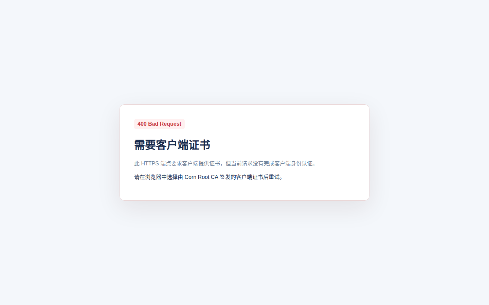
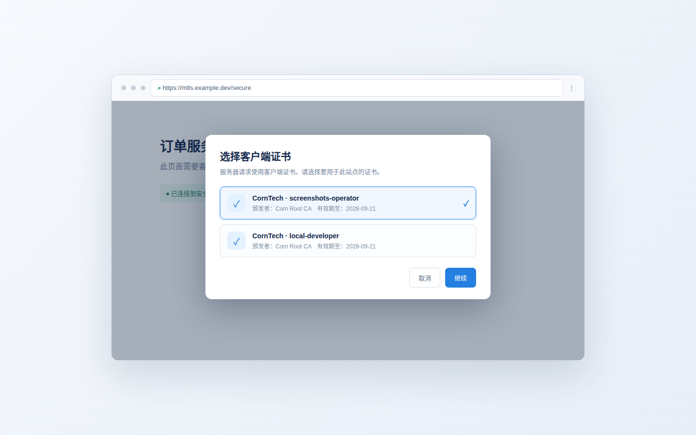

# 双向证书（mTLS）使用介绍

CornTech 负责创建和管理自签 CA、服务器证书和客户端证书。双向 TLS（mTLS）在普通 HTTPS 的基础上增加客户端证书校验：服务器验证客户端证书，客户端也验证服务器证书。适合内部 API、管理后台、设备接入和服务间调用。

## 证书关系

```text
Corn Root CA
├── 服务器证书：mtls.example.dev
└── 客户端证书：orders-client
```

浏览器或客户端必须信任 Corn Root CA；Nginx 必须配置服务器证书、服务器私钥和用于验证客户端证书的 CA 根证书。

## 准备证书

在证书管理服务所在机器上初始化 CA，并创建服务器和客户端证书。以下命令保留现有 CLI 用法；输出文件同时登记到证书目录。

```bash
export ROOTPASS='change-this-root-password'

# 首次初始化 RSA / EC 根 CA
./gen_root_cert.sh

# 服务器证书：CN 为 mtls.example.dev，SAN 包含域名
days=398 ./gen_server_cert.sh mtls.example.dev

# 客户端证书：导出 p12 后导入浏览器或操作系统
days=365 ./gen_client_cert.sh orders-client
```

服务器证书至少需要以下文件：

```text
out/agents/<agent-id>/server/<certificate-id>/<timestamp>/rsa_mtls.example.dev.bundle.crt
out/agents/<agent-id>/server/<certificate-id>/<timestamp>/rsa_mtls.example.dev.key
```

客户端证书使用：

```text
out/agents/<agent-id>/client/<certificate-id>/<timestamp>/rsa_orders-client.p12
out/agents/<agent-id>/client/<certificate-id>/<timestamp>/rsa_orders-client.key
out/rsa_root.crt
```

`.p12` 文件包含客户端证书和私钥，示例密码仍为 `1234`；生产环境请在导出流程中改用独立密码并使用安全的密钥分发方式。

## Nginx 部署

将服务器证书、私钥和根 CA 放到 Nginx 可读目录，并限制私钥权限：

```bash
install -m 0644 rsa_mtls.example.dev.bundle.crt /etc/nginx/certs/mtls.bundle.crt
install -m 0600 rsa_mtls.example.dev.key /etc/nginx/certs/mtls.key
install -m 0644 rsa_root.crt /etc/nginx/certs/corn-root.crt
```

配置一个要求客户端证书的 HTTPS server：

```nginx
server {
    listen 443 ssl;
    server_name mtls.example.dev;

    ssl_certificate     /etc/nginx/certs/mtls.bundle.crt;
    ssl_certificate_key /etc/nginx/certs/mtls.key;

    # 用 Corn Root CA 验证客户端证书
    ssl_client_certificate /etc/nginx/certs/corn-root.crt;
    ssl_verify_client on;
    ssl_verify_depth 2;

    location / {
        proxy_set_header X-Client-Verify $ssl_client_verify;
        proxy_set_header X-Client-Subject $ssl_client_s_dn;
        proxy_pass http://127.0.0.1:8081;
    }
}
```

`ssl_verify_client on` 会在客户端没有证书或证书验证失败时拒绝请求。修改配置后检查并重载：

```bash
nginx -t
systemctl reload nginx
```

## 验证双向 TLS

不带客户端证书访问受保护端点时，Nginx/上游会返回 400。截图中的页面来自本地可复现的 400 演示端点，实际 Nginx 返回文案可能是 `No required SSL certificate was sent`：



使用客户端证书访问：

```bash
curl --cacert /etc/nginx/certs/corn-root.crt \
     --cert rsa_orders-client.crt \
     --key rsa_orders-client.key \
     https://mtls.example.dev/secure
```

浏览器使用 `.p12` 的步骤：

1. 将 `rsa_orders-client.p12` 导入操作系统或浏览器证书库。
2. 访问 `https://mtls.example.dev/secure`。
3. 在浏览器证书选择器中选择 `CornTech · orders-client`。
4. 确认页面可以访问，并在 Nginx 日志中检查 `$ssl_client_verify` 为 `SUCCESS`。

不同操作系统和浏览器的原生证书选择器外观不同；下面截图使用本地演示页复现选择状态，实际弹窗由浏览器根据客户端证书库生成：



## 常见问题

**返回 400，但客户端已经选择证书。** 检查客户端证书是否由 Nginx 配置的同一个根 CA 签发，并确认私钥与证书匹配。

**浏览器没有弹出证书选择。** 确认 `.p12` 已导入当前浏览器 profile，关闭旧连接后重新打开 HTTPS 地址；若只有一个可用证书，部分浏览器会自动选择。

**curl 可以访问，浏览器不行。** 检查浏览器是否信任服务器证书链，并确认导入的是客户端 `.p12` 而不是服务器 `.p12` 或单独的 `.crt`。

双向 TLS 只解决证书身份认证，不提供证书吊销、自动续期或费用结算；这些能力需要另外的生命周期和运营配置。
